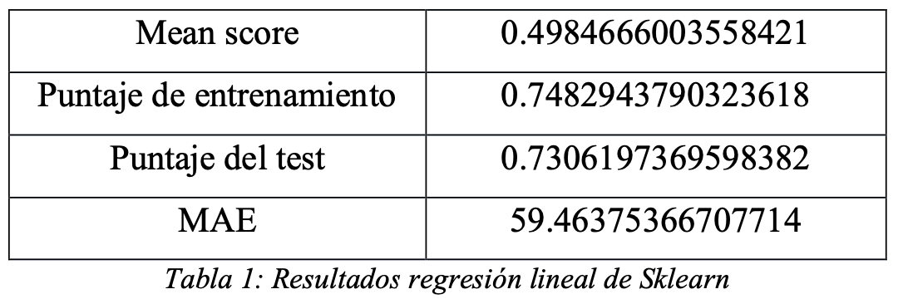

# Predicción de calorias

Este es un proyecto de predicción de calorías a través de modelos como Regresión Lineal y de árbol de desición.

La base de datos *nutrimental.xlsx* se generó de manera manual, siendo una bitácora de consumo de alimentos con cada una de sus porciones e información nutrimental.

El archivo *Analisisnutrimental.py* contiene el pre-tratamiento necesario de los datos y la implementación de los modelos mencionados y sus optimizaciones. 

El pdf muestra el análisis de los resultados obtenidos en Notebook.

